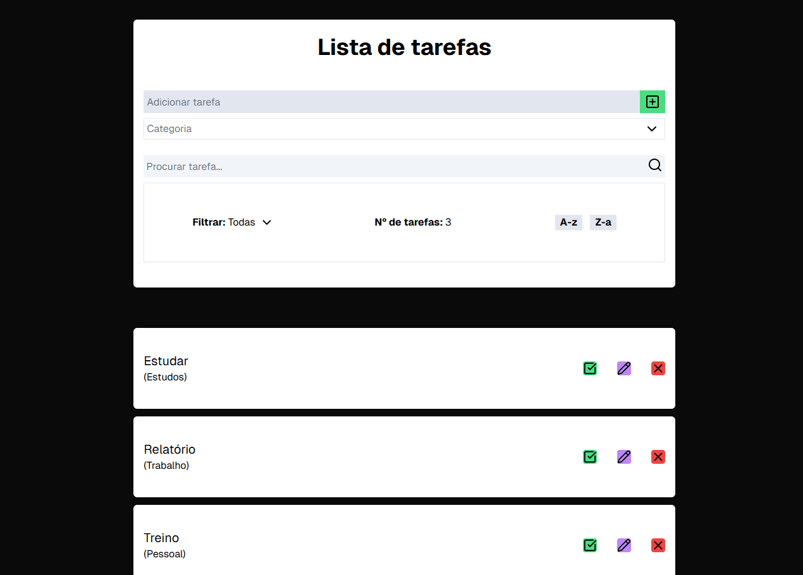

# Todo List 🗒️

Este projeto foi desenvolvido como parte dos meus estudos. O objetivo foi praticar conceitos essenciais como manipulação de estados, tipagem com TypeScript e estilização com Tailwind CSS, além de trabalhar com validação de formulários usando React Hook Form e Yup.

 ## Funcionalidades

- **Adicionar tarefas** → Criação de novas tarefas com título e categoria

- **Editar e excluir tarefas** → Permite modificar ou remover tarefas

- **Marcar como feita/a fazer** → Alterna entre tarefa concluída ou pendente

- **Filtro por status** → Exibe apenas as tarefas filtradas por "feitas", "a fazer" ou "todas".

- **Contador de tarefas** → Mostra a quantidade de tarefas filtradas

- **Barra de pesquisa** → Busca tarefas pelo título

- **Ordenação alfabética** → Organiza as tarefas de A-Z ou Z-A

- **Responsividade** → Layout adaptável para diferentes tamanhos de tela

## Tecnologias

## Visão geral

